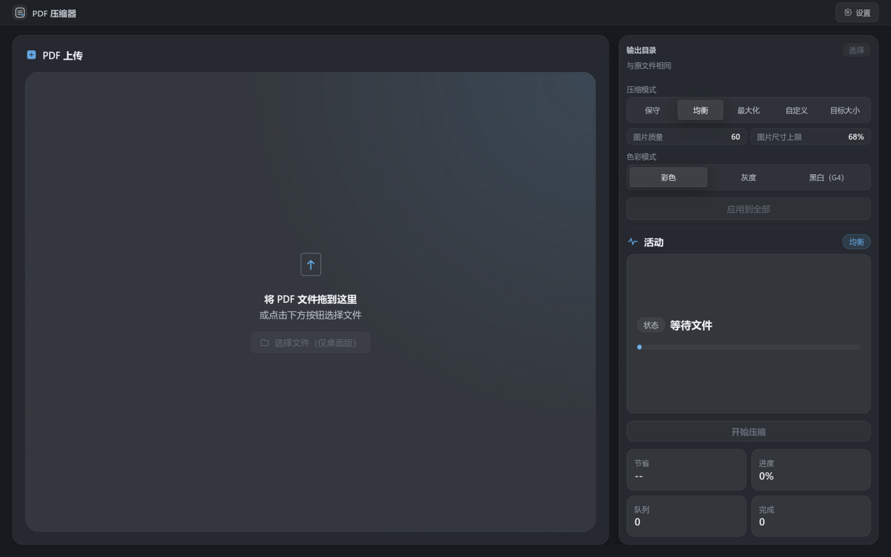

# PDF Compressor

English | [简体中文](README.zh-CN.md)

A local-first desktop app that makes PDFs smaller — without breaking what matters. Text stays text, vectors stay vectors; only the heavy parts (images, fonts, redundant objects) are optimized.



## Why this one

- **Selective, not blind**: an analysis pass classifies each document and recommends a preset; the optimizer only rewrites what is provably safe (text and vector instructions are never rasterized)
- **Serious image codec work**: JPEG re-encoding with SIMD, downsampling, grayscale conversion, and lossless CCITT G4 for black-and-white scans; G3/G4 fax inputs decode and transcode
- **Structural lossless passes**: byte-identical streams deduplicate, unused font/XObject resources are removed, embedded CID TrueType fonts subset to used glyphs (opt-in)
- **Target-size mode**: give it a byte budget (e.g. under 5 MB for an email attachment) and it searches quality/resolution parameters until the output fits — distributing quality across images by content detail
- **Safe by construction**: encrypted files that need a password are handled explicitly (prompt, or `--password`), owner-password files unlock cleanly, and an output that wouldn't beat the original is never written
- **Local-first**: no uploads, no telemetry, everything on your machine
- **Batch-friendly**: multi-file queue in the GUI, one-liner CLI for scripts, and right-click integration on Windows Explorer, macOS Finder, KDE Dolphin, and GNOME Files

## Install

| Platform | Source |
| --- | --- |
| Arch Linux | AUR: `yay -S pdf-compressor-bin` (binary package built from [Releases](https://github.com/cosct/pdf-compressor/releases) assets) or `yay -S pdf-compressor` (source package); or `pnpm run tauri:arch` for a local zst |
| Windows | NSIS installer from [Releases](https://github.com/cosct/pdf-compressor/releases) (ships the CLI and an Explorer context menu) |
| macOS | `.dmg` from [Releases](https://github.com/cosct/pdf-compressor/releases) (+ optional Finder Quick Action, see user guide) |
| Any | Build from source: `pnpm install && pnpm run tauri build` (Rust 1.93+, Node 22+) |

## Quick start

**GUI** — drag PDFs in, review the analysis, press *Start compression*. Outputs land next to the originals as `name__optimized-<preset>.pdf`.

**CLI** — analyze, compress, or right-click-style quick mode:

```bash
pdf-compressor-cli analyze input.pdf
pdf-compressor-cli compress input.pdf --preset maximum
pdf-compressor-cli compress input.pdf --target-size 5MB   # fit under a budget
pdf-compressor-cli compress - --stdout < in.pdf > out.pdf # pipe mode (stdin→stdout)
pdf-compressor-cli quick input.pdf --bilevel g4            # headless + notification
pdf-compressor-cli quick scans/ --no-notify                # recurse a directory
```

## Documentation

| Document | Audience |
| --- | --- |
| [User guide (中文)](docs/USER-GUIDE.zh-CN.md) | Everyone — install, GUI & CLI usage, context menus, password handling, FAQ |
| [Changelog](CHANGELOG.md) | Everyone — release history |
| [Development guide](docs/DEVELOPMENT.md) | Contributors — architecture, conventions, packaging, maintainer notes |
| [Testing guide](docs/TESTING.md) | Contributors / QA — test pyramid, quality gates, fuzzing, mutation testing |

## Tech stack

Rust engine (`lopdf`, `jpeg-encoder`, `fax`, `subsetter`, SIMD resize) · Vue 3 + TypeScript · Tauri 2 · MIT licensed

Output behavior, limitations, and troubleshooting are covered in the user guide.
