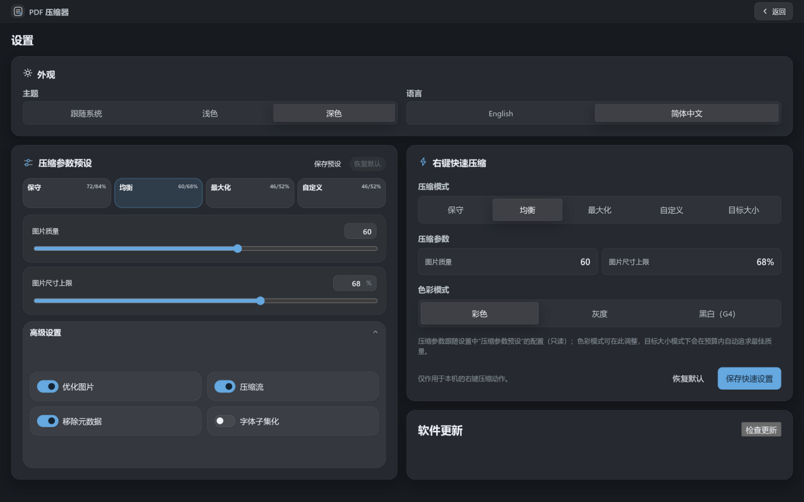

# PDF 压缩器 · 用户指南

面向使用本应用的普通用户与运维/脚本作者。涵盖安装、图形界面、命令行、文件管理器右键集成、加密文档处理、应用更新与常见问题。

- 项目概览与快速上手见 [README](../README.zh-CN.md)
- 版本历史见 [更新日志](../CHANGELOG.md)
- 想参与开发/测试？见 [开发指南](DEVELOPMENT.md) 与 [测试指南](TESTING.md)

---

## 目录

1. [安装](#1-安装)
2. [图形界面工作流](#2-图形界面工作流)
3. [压缩参数详解](#3-压缩参数详解)
4. [加密（带密码）文档](#4-加密带密码文档)
5. [命令行手册](#5-命令行手册)
6. [文件管理器右键集成](#6-文件管理器右键集成)
7. [应用内更新](#7-应用内更新)
8. [输出行为与安全保证](#8-输出行为与安全保证)
9. [常见问题 FAQ](#9-常见问题-faq)
10. [术语速查](#10-术语速查)
11. [已知限制](#11-已知限制)

---

## 1. 安装

### Arch Linux

```bash
yay -S pdf-compressor-bin     # 二进制包；或 yay -S pdf-compressor（源码包）
```

AUR 二进制包（无需 Rust/Node 工具链），内容与 GitHub Release 的 zst 完全一致：GUI（`pdf-compressor`）、命令行（`pdf-compressor-cli`）、KDE Dolphin 右键菜单；GNOME/Nemo 脚本随包放在 `/usr/share/pdf-compressor/nautilus/`。源码包 `pdf-compressor` 从同一 Release 自动更新（cargo + pnpm 从源码构建），两者文件布局一致，互相 provides/conflicts，切换时会自动替换。

自行构建 zst：`pnpm run tauri:arch`（详见 [`packaging/archlinux/README.md`](../packaging/archlinux/README.md)）。

### Windows

从 [Releases](https://github.com/cosct/pdf-compressor/releases) 下载 NSIS 安装包。安装器会：

- 安装 GUI 与命令行工具（`安装目录\binaries\pdf-compressor-cli.exe`）
- 注册资源管理器 PDF 右键子菜单（卸载时自动清理）

便携版可执行文件也在 Release 资产中。

### macOS

从 [Releases](https://github.com/cosct/pdf-compressor/releases) 下载 `.dmg`（通用二进制，Intel/Apple Silicon 均可）。可选安装访达快速操作：

```bash
bash packaging/macos/quick-action/install.sh
# 应用不在 /Applications 时：install.sh "/实际路径/PDF Compressor.app/Contents/Resources/binaries/pdf-compressor-cli"
```

### 源码构建（任意平台）

```bash
pnpm install
pnpm run tauri build          # 产出各平台安装包
```

依赖：Rust 1.93+（引擎 crate 为 1.88+）、Node.js 22+、pnpm；Linux 另需 `webkit2gtk-4.1`、`gtk3`、`librsvg`。

---

## 2. 图形界面工作流


界面分三块：**左侧文件队列**、**右侧预设与活动面板**、**顶部设置入口**。

### 基本流程

1. **添加文件**：把一个或多个 PDF 拖进左侧区域，或点击“选择文件”（仅桌面版）。重复添加同一文件会自动忽略。
2. **自动分析**：每个文件入队后立即分析——分类为文本型 / 混合型 / 扫描型，估算可压缩比例并推荐预设。分析只读原文件，不产生任何输出。
3. **调整设置**：右侧可为当前选中文件单独调整；多个文件时可用“应用到全部”统一。
4. **开始压缩**：点击“开始压缩”（多文件时按钮显示总数）。多文件按机器核数并行（最多同时 2 个），每个文件可单独取消。
5. **查看结果**：完成后队列行显示“原始大小 → 压缩后”与节省百分比；可一键打开输出文件或定位到所在文件夹。

### 文件队列

- 每个文件独立的状态徽标：已入队 / 分析中 / 就绪 / 压缩中 / 完成 / 需要注意
- 会话持久化：关闭应用再打开，文件列表与逐文件设置自动恢复（已不存在的文件会被跳过并提示）
- 输出目录可全局设置（默认与原文件相同目录）

### 活动面板

显示当前选中文件的预设、实时进度条、节省/进度/队列/完成四项指标，以及后端报告的说明性通知（如“已将 N 张近黑白图片转为无损 G4”）。

### 设置页



点击顶栏“设置”进入，包含四张卡片：

- **外观**：主题（跟随系统/浅色/深色）与语言（English/简体中文）
- **压缩参数预设**：编辑保守/均衡/最大化三个内置预设的参数，或创建自定义预设；保存后全局生效
- **右键快速压缩**：配置文件管理器右键动作使用的参数（GUI 保存，CLI 读取）
- **软件更新**：手动检查新版本，确认后下载安装（见[第 7 节](#7-应用内更新)）

---

## 3. 压缩参数详解

### 压缩模式

| 模式 | 内置参数（JPEG 质量 / 最长边上限） | 说明 |
| --- | --- | --- |
| **保守** | 质量 72 / 上限 84% | 质量优先，适合需要留档打印的文件 |
| **均衡**（默认） | 质量 60 / 上限 68% | 绝大多数场景的体积/质量平衡点 |
| **最大化** | 质量 46 / 上限 52% | 追求最小体积 |
| **自定义** | 手动调整下面所有参数 | |
| **目标大小** | 给定 MB 预算，引擎自动搜索质量/分辨率直到达标（详见下文） | |

**“最长边上限”是百分比**：相对**本文档中最大那张图片的最长边**计算——上限随文件自适应（文档最大图 4000px、选均衡 → 上限 2720px；最大图本来就小则上限也小）。文件还没分析过时，按 3200px 的默认参考边折算。引擎只把**超过上限**的图片缩小到上限，不超过的不动。

预设的具体数值可在设置页修改并持久化。

> **命令行用户注意**：`--max-edge` 是**绝对像素**（不是百分比），不指定时按档位取 2400/1800/1400px、质量 82/72/58——与图形界面的百分比预设是两套不同的内置默认值，同名档位在两处的实际行为并不相同。这一不一致已列入 0.9.0 的统一计划。

### 色彩模式

- **彩色**：保持原样重编码
- **灰度**：彩色图转 8 位灰度，黑白文档可省约一半图片体积
- **黑白（G4）**：几乎纯黑白两色的图片（比如文字扫描件）转用 **G4** 编码——这是传真机使用的无损压缩格式，压完清晰度不损失，体积通常只有 JPEG 的零头；彩色照片不受影响，仍走 JPEG

### 高级开关

- **优化图片**（默认开）：关闭后图片原样保留
- **压缩内部数据**（默认开）：文件里未压缩的部分用无损算法压紧（与 ZIP 同类，内容不变、体积变小）
- **移除元数据**（默认开）：清除作者、制作软件等附加信息（不影响正文）
- **字体子集化**（默认关）：把文件里内嵌的字体裁剪为文档实际用到的那些字符——嵌入整套中文字体的大文档收益显著

### 目标大小模式

输入预算（0.1–2048 MB），引擎的行为：

1. 在**全量程**质量区间二分搜索（上限 100，下限 15），找到能进入预算的最高质量
2. 整个质量区间都超预算时，按最长边 ×¾ 逐级缩小再搜
3. 搜索在内存中完成（解码缓存跨轮复用），只在确定最终参数后落盘一次
4. 同预算内按图片内容细节分配质量：平坦页低质量几乎无感、细节页保持高质量
5. 确实无法达标时输出“当前可达的最小结果”并给出警告通知

### 输出文件命名

`原文件名__optimized-<预设>.pdf`，输出目录有同名文件时自动追加 `-1`、`-2`……；**永远不会覆盖原文件**。

---

## 4. 加密（带密码）文档

| 文档类型 | 行为 |
| --- | --- |
| 未加密 | 正常处理 |
| 仅 owner 密码（限制打印/编辑的那种） | 自动以空密码解锁并正常压缩，输出为无加密文件，附通知说明 |
| 需要**打开密码**，未提供密码 | GUI：弹窗提示输入；CLI：报 `error.passwordRequired` |
| 打开了密码，但密码错误 | GUI：弹窗要求重试；CLI：报 `error.wrongPassword` |
| DRM 加密（电子书等） | 明确拒绝——此类文件没有合法的重写路径 |

GUI 输入的密码只保存在会话内存中：重启应用后需要重新输入，也**绝不会**写入任何持久化文件。同一文件分析成功后，后续压缩自动携带该密码。

---

## 5. 命令行手册

`pdf-compressor-cli` 与 GUI 共享同一引擎。三个子命令：

### `analyze` —— 分析文档

```bash
pdf-compressor-cli analyze input.pdf [--password <PW>]
```

输出 JSON：页数、图片数量、文档分类（文本为主 / 图文混合 / 扫描为主）、看起来像扫描件的可能性评分、预估可省比例、推荐预设等。

### `compress` —— 压缩并输出 JSON 报告

```bash
pdf-compressor-cli compress input.pdf [OPTIONS]
```

管道模式（stdin 进、stdout 出）：

```bash
pdf-compressor-cli compress - --stdout [OPTIONS] < input.pdf > output.pdf
```

输入读自 stdin，PDF 字节写往 stdout，JSON 摘要走 stderr（stdout 保持纯 PDF 流）。压缩赢不过原文件时直通原始字节——下游永远拿到合法 PDF，退出码仍为 0。不可与 `--output-dir`、`--target-size` 组合。

### `quick` —— 后台批量模式（右键菜单同款）

```bash
pdf-compressor-cli quick a.pdf b.pdf 目录/ [OPTIONS]
```

输出写在原文件旁；压不小于原文件的跳过不写；完成后发桌面通知（Linux 需 `libnotify`）；stdout 打印逐文件 JSON 汇总，错误走 stderr。目录参数会递归收集其中的 `.pdf` 文件（不分大小写；跳过符号链接目录，遍历不会成环）；同一文件只压缩一次——目录和其中的文件一起传、或用不同写法传同一文件，都会按真实路径自动去重。

### 全部旗标

| 旗标 | 适用 | 说明 |
| --- | --- | --- |
| `--preset <NAME>` | 全部 | `maximum` / `balanced` / `conservative`，默认 balanced |
| `--quality <N>` | 全部 | JPEG 质量 10–100 |
| `--max-edge <PX>` | 全部 | 图片最长边上限（像素，100–8000） |
| `--grayscale` | 全部 | 彩色图转灰度 |
| `--bilevel <CODEC>` | 全部 | 近黑白图编码：`g4`（无损 CCITT G4）/ `jpeg` |
| `--subset-fonts` | 全部 | 启用字体子集化 |
| `--convert-cmyk` | 全部 | 印刷色彩（CMYK）的图片转为屏幕色彩（RGB）后重编码（默认开启；官方安装包的转换效果与专业看图软件的显示一致，自编译且未开启色彩组件时这类图片保持原样） |
| `--no-convert-cmyk` | 全部 | 印刷色彩（CMYK）的图片保持原样（关闭默认转换） |
| `--keep-metadata` | 全部 | 保留元数据（默认移除） |
| `--target-size <SIZE>` | 全部 | 目标体积预算，如 `5MB`、`500K`、字节数 |
| `--password <PW>` | 全部 | 打开密码（quick 模式作用于整批） |
| `--output-dir <DIR>` | compress | 输出目录（quick 固定写在原文件旁，不支持） |
| `--stdout` | compress | 管道模式：PDF 字节写 stdout、摘要走 stderr（输入用 `-` 读 stdin） |
| `--no-notify` | quick | 跳过桌面通知 |

未指定的字段回落到 GUI 设置页保存的“右键快速压缩”配置（`<配置目录>/pdf-compressor/quick-profile.json`），再回落到内置默认。

> 提示：`--password` 的值可能进入 shell 历史。脚本场景可用环境变量展开（`--password "$PDF_PW"`）。

### 退出码

- `0`：成功（quick 模式下“全部没变小”也算成功）
- `1`：参数错误、文件不存在、加密拒绝、全部失败等

### 脚本集成示例

```bash
# 把目录下所有 PDF 压到 2MB 以内，失败的记日志
for f in *.pdf; do
  pdf-compressor-cli quick "$f" --target-size 2MB --no-notify || echo "failed: $f" >> failed.log
done

# 整个目录递归压缩（quick 接受目录参数）
pdf-compressor-cli quick 扫描件/ --no-notify

# 管道：边下载边压缩，不落中间文件
curl -s https://example.com/big.pdf | pdf-compressor-cli compress - --stdout > small.pdf
```

---

## 6. 文件管理器右键集成

| 平台 | 菜单位置 | 动作 | 启用方式 |
| --- | --- | --- | --- |
| KDE Dolphin | PDF 右键 → “PDF 压缩”子菜单 | 应用内配置 / 最大化 / 扫描件灰度 / 黑白 G4 / 5MB 以内 | Arch 包自动安装 |
| GNOME Files (Nautilus) / Nemo | 右键 → 脚本 → PDF Compressor | 同上 5 项 | `bash packaging/nautilus/install.sh`（`--uninstall` 移除） |
| Windows 资源管理器 | PDF 右键 → "Compress with PDF Compressor" 子菜单 | 应用内配置 / 最大化 / 5MB 以内 | NSIS 安装包自动注册 |
| macOS 访达 | 右键 → 快速操作 → Compress with PDF Compressor | 应用内配置 | `bash packaging/macos/quick-action/install.sh` |

右键动作即 `quick` 模式：后台压缩、不弹窗口、完成发通知。所用参数在 GUI 设置页的“右键快速压缩”卡片中配置。

- GNOME 脚本可通过 `PDF_COMPRESSOR_CLI` 环境变量指定非默认路径的 CLI。
- macOS 服务默认指向 `/Applications/PDF Compressor.app`，应用装在别处时给 `install.sh` 传 CLI 完整路径。

---

## 7. 应用内更新

设置页 → “软件更新” → **检查更新**：

- 有新版本：显示版本号，点击“下载并安装”；完成后按提示重启
- 已是最新：显示当前版本号
- 手动触发、无静默自动更新；浏览器预览模式下该功能显示“未配置更新通道”

更新包经 minisign 公钥验签（公钥内置在应用内），校验不过不会安装。

---

## 8. 输出行为与安全保证

- **全程在你电脑上跑**：压缩过程无任何网络上传（唯一联网行为是第 7 节的更新检查，且需手动触发）
- **不覆盖原文件**：输出始终是新文件
- **压不小就不动手**：优化结果没有小于原文件时，不写任何文件并明确告知（原文件即最优解）
- **内容保真承诺**：文字和线条图形永远不会被转成图片或重新排版（所以压缩后仍可搜索、复制）；书签/大纲、链接结构原样保留（有专项测试守护）；仅在“可证明安全”的条件下重写图片、字体、冗余数据
- **失败即跳过**：单张图片解码/重编码失败只跳过该图，不会中止整个文件，更不会产出损坏输出
- **加密不越权**：见[第 4 节](#4-加密带密码文档)

---

## 9. 常见问题 FAQ

**Q：压缩后文本还能搜索、复制吗？**
能。文字永远保持为文字（不会被转成图片），这也是本项目与“整页转图”式压缩工具的根本区别。

**Q：为什么我的文件只小了一点？**
先看分析结果的文档分类：以文字为主的 PDF（体积主要花在字体和正文上）本来就没多少可压；个别用了特殊图片格式的文件，稳妥起见会跳过那些图片（分析会报告“不受支持的编码”）；文件本来就很紧凑时引擎会直接放弃（压不小就不动手）。另外注意：预估按**默认设置**计算（含“转换 CMYK 图片”开启）——如果你在设置里关闭了这项或改用了更保守的档位，含印刷色图片的文件实际节省会低于预估。

**Q：扫描件用哪个模式？**
分析判定为“扫描型”的文件会自动走扫描管线。黑白文字扫描件把色彩模式设为“黑白（G4）”收益最大；彩色扫描件可用“灰度”或直接“最大化”。

**Q：目标大小没达标怎么办？**
预算过小时（如把 500 页画册压进 1MB）物理上不可达，引擎会给出能达成的最小结果并警告。可调低预算合理性或接受折中。

**Q：输出的 PDF 兼容性如何？**
输出遵循 PDF 标准（内部用了 2003 年以后所有阅读器都支持的组织方式）。G4 图片是上世纪 80 年代的传真标准，兼容性极好。

**Q：支持 PDF/A 或线性化（快速 Web 视图）吗？**
暂不支持，见[已知限制](#10-已知限制)。

**Q：右键菜单没出现？**
KDE：确认装的是 Arch 包且未禁用 ServiceMenu。GNOME：运行安装脚本后重启 Nautilus（`nautilus -q`）。Windows：确认用 NSIS 安装包安装（便携版不注册菜单）。macOS：部分系统需要在 系统设置 → 键盘 → 键盘快捷键 → 服务 中手动启用。

**Q：怎么彻底重置设置？**
删除配置目录下的 `pdf-compressor/`（Linux `~/.config/`，Windows `%APPDATA%`，macOS `~/Library/Application Support/`）。队列与设置都在里面，删除不影响已生成的输出文件。

**Q：从 0.7.x 升级后，"转换 CMYK 图片"是开的还是关的？**
0.8.0 起这项功能默认开启。升级时会自动处理旧配置：0.7 保存的"未开启"（当时的出厂默认）会被重置、跟随新默认变为开启；当时**主动开启**过的保持开启。升级后想关掉：设置里取消勾选，或命令行加 `--no-convert-cmyk`——0.8 起写入的"关闭"代表你的真实选择，不会被再次改动。想确认转换有没有生效：看压缩报告（JSON）里印刷色图片是否计入了 `imagesRecompressed`（而不是被跳过）。注意：自编译且未开启色彩组件的版本没有转换能力，会保持这类图片原样，报告里的跳过原因会写明。

---

## 10. 术语速查

遇到看不懂的词？这里用大白话解释本指南和设置界面里出现的术语。

| 术语 | 大白话解释 |
| --- | --- |
| **无损 / 有损** | 无损 = 解开之后和原来一模一样（如 ZIP）；有损 = 换来更小体积的同时丢掉一些人眼不易察觉的细节（如 JPEG 照片） |
| **重编码** | 把图片按新的质量/尺寸重新压缩一遍。本工具只对图片做有损操作，文字永远不动 |
| **下采样（缩小分辨率）** | 把 4000×3000 的照片缩到 1800×1350 存放——屏幕上看不出差别，体积小很多 |
| **灰度** | 去掉颜色只留明暗的黑白照片效果；黑白文档转灰度约省一半图片体积 |
| **G4（传真压缩）** | 传真机使用的黑白图片无损压缩格式，特别适合文字扫描件 |
| **双色调 / 近黑白** | 图片几乎只有纯黑纯白两色（如扫描的文字页）。“近”指允许极少量过渡灰点 |
| **CMYK（印刷色彩）** | 印刷机用的四色模式（青、品红、黄、黑）。专业设计软件导出的 PDF 常用它存图；屏幕显示用的是 RGB 三色，转换需要专业的色彩计算才不偏色 |
| **色彩管理** | 一套保证"同一颜色在不同设备上看起来一样"的专业计算。官方安装包内置了和 Photoshop 等软件同类的色彩引擎 |
| **元数据** | 文件里"关于文件的信息"：作者、制作软件、关键词等，不影响正文显示 |
| **内嵌字体 / 字体子集化** | PDF 可以把整套字体随身携带以保证任何设备显示一致；子集化 = 只保留文档实际用到的那几十上百个字符，丢弃其余 |
| **管道模式（stdin/stdout）** | 命令行的"接水管"用法：让上一个命令的输出直接流进本工具、结果再流给下一个命令，中间不产生临时文件 |
| **栅格化** | 把文字/线条转成图片点阵。转了就不能再搜索复制——本工具承诺永远不做这件事 |
| **冗余对象** | 多次编辑后文件里积累的重复、无引用数据，好比文档里的"垃圾抽屉" |

---

## 11. 已知限制

| 限制 | 说明 | 计划 |
| --- | --- | --- |
| 自编译版本不转换印刷色图片 | 官方安装包自 0.8.0 起默认把印刷色彩（CMYK）图片转为屏幕色彩重编码；自编译且未开启色彩组件的版本没有这个能力，宁可保持图片原样也不做会偏色的粗略转换（灰度/黑白模式不受影响） | 维持现状 |
| 字体子集化仅覆盖 CID 字体 | 简单字体（Type1/PFB）不动（低收益） | 暂缓 |
| 单文件上限 2GiB | 全内存处理的安全上限 | 流式处理在"明确不做清单"中 |
| 无线性化输出 | 上游 lopdf 的实现是空壳 | 等待上游或另立项 |
| 不校验 PDF/A 合规 | 输出不保证 PDF/A 档案合规 | 暂无计划 |
